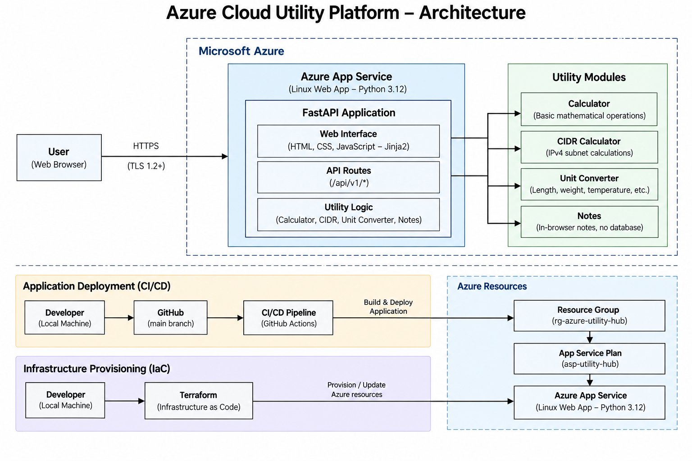

# Azure Cloud Utility Platform — Architecture

## 1. Architecture Overview

The Azure Cloud Utility Platform is a small web application that brings several technical utilities together in one place. The current version includes a calculator, an IPv4 CIDR calculator, a unit converter, and a notes feature.

The application is written in Python using FastAPI. The frontend is served by the same application and uses HTML, CSS, and JavaScript. The current deployment runs on Azure App Service.

The first version has deliberately been kept simple. There is no database, container platform, or separate frontend service at this stage. The focus was to build a working application, deploy it to Azure, and establish a clean foundation that can be extended later.

### Current Architecture

A user accesses the application through HTTPS. The request reaches the Azure App Service, where the FastAPI application either serves the web interface or handles one of the utility API requests.

User
  │
  │ HTTPS
  ▼
Azure App Service
  │
  ▼
FastAPI Application
  │
  ├── Web Interface
  ├── Calculator API
  ├── CIDR API
  └── Unit Converter API

The application code is kept under the `app` directory. The individual utilities have their own Python modules, while the HTML, CSS, and JavaScript resources are kept with the application.

The current Azure resources are:

* Resource Group: `rg-azure-utility-hub`
* App Service Plan: `asp-utility-hub`
* Linux Web App: `app-utility-hub`

These resources are managed through Terraform.

## 2. Component Architecture

The application is divided into a few small components rather than putting all of the logic into a single Python file.

The current application structure is:

app/
├── main.py
├── calculator.py
├── cidr.py
├── converter.py
├── static/
│   ├── script.js
│   └── style.css
├── templates/
│   └── index.html
└── __init__.py

### FastAPI Application

`main.py` is the entry point of the application. It creates the FastAPI application, serves the main HTML page, exposes the API endpoints, and connects the utility modules.

The current API endpoints are:

GET  /
GET  /health

POST /api/v1/calculator
POST /api/v1/cidr
POST /api/v1/convert

The `/health` endpoint provides a simple application-level health check.

### Calculator

The calculator logic is kept in `calculator.py`.

The frontend sends the selected operation and two values to the calculator API. The API passes those values to the calculator module and returns the result.

Keeping the calculation logic separate makes it possible to test it independently from the web application.

### CIDR Calculator

The CIDR functionality is contained in `cidr.py`.

It accepts an IPv4 CIDR block and calculates information such as the network address, broadcast address, subnet mask, wildcard mask, usable host range, and address count.

Invalid CIDR input is handled by the API layer and returned as an HTTP 400 response.

### Unit Converter

The unit conversion logic is handled by `converter.py`.

The frontend provides the category, source unit, destination unit, and value. The API passes these values to the converter module and returns the result.

The current converter includes categories such as:

* Length
* Weight
* Temperature
* Data

### Frontend

The web interface is served directly by FastAPI using Jinja2 templates.

The main HTML page is:

app/templates/index.html

The frontend behaviour is handled by:

app/static/script.js

The styling is contained in:

app/static/style.css

There is currently no separate frontend hosting service.

The notes functionality is part of the frontend experience and does not currently require a backend database or separate persistence service.

### Request Flow

A typical utility request follows this path:

Browser
   │
   ▼
FastAPI Route
   │
   ▼
Utility Module
   │
   ▼
Calculation / Conversion
   │
   ▼
JSON Response
   │
   ▼
Browser

This keeps the API layer responsible for request handling while the utility modules contain the actual processing logic.

## 3. Infrastructure and Deployment

The project uses Terraform to manage the Azure infrastructure and Azure App Service to run the application.

These are treated as two separate parts of the deployment process.

### Terraform Configuration

The Terraform configuration is stored in the `terraform` directory:

terraform/
├── providers.tf
├── variables.tf
├── main.tf
├── app_service.tf
└── outputs.tf

`providers.tf` defines the AzureRM provider and Terraform requirements.

`variables.tf` contains configurable values such as the resource group name and Azure region.

`main.tf` defines the Azure resource group.

`app_service.tf` defines the App Service Plan and Linux Web App.

`outputs.tf` exposes useful deployment information such as the resource group name, location, and web app hostname.

The current App Service uses a Linux B1 plan and Python 3.12.

The application startup command is configured through Terraform:

python -m uvicorn app.main:app --host 0.0.0.0 --port 8000

The application also enables Azure's deployment build process so that the dependencies in `requirements.txt` are installed during deployment.

### Infrastructure Workflow

The current infrastructure workflow is:

Terraform Configuration
         │
         ▼
   terraform init
         │
         ▼
  terraform validate
         │
         ▼
    terraform plan
         │
         ▼
   terraform apply
         │
         ▼
    Azure Resources

Terraform compares the desired configuration with the existing infrastructure and proposes the required changes.

After the initial resources were created, subsequent `terraform plan` runs showed no changes when the Azure infrastructure already matched the Terraform configuration.

### Application Deployment

Application deployment is currently performed separately using the Azure CLI.

The application is packaged and deployed to the Azure Web App. Azure's deployment build process installs the dependencies specified in `requirements.txt`.

The current deployment flow is:

Local Application
       │
       ▼
  Build Package
       │
       ▼
  Azure CLI Deploy
       │
       ▼
Azure App Service
       │
       ▼
FastAPI Application

The current process is intentionally simple. GitHub is used for source control, while application deployment is still initiated manually.

A CI/CD pipeline is planned for a later stage.

## 4. Security Architecture

Security is treated as part of the architecture rather than something added after deployment.

The current application is small and does not store user accounts, credentials, or application data in a database. The security controls are therefore focused on the application's current attack surface.

### HTTPS and TLS

The Azure Web App is configured with HTTPS-only access.

The App Service also requires a minimum TLS version of 1.2.

These settings provide a basic secure transport layer between users and the application.

### Application Validation

The API uses FastAPI and Pydantic for request handling and validation.

For example, the calculator endpoint accepts a defined request model containing:

CalculatorRequest
├── operation
├── a
└── b

Expected input errors from the calculator, CIDR calculator, and converter are handled by the API layer and returned as HTTP 400 responses.

This prevents normal user input errors from becoming unhandled application failures.

### Deployment Security

The App Service has FTP and WebDeploy basic authentication disabled:

ftp_publish_basic_authentication_enabled       = false
webdeploy_publish_basic_authentication_enabled = false

Terraform state files and sensitive local configuration files are also excluded from Git through `.gitignore`.

The repository does not intentionally contain application secrets.

### Current Security Boundary

The current security boundary can be summarized as:

User
  │
  │ HTTPS
  ▼
Azure App Service
  │
  ▼
FastAPI Application
  │
  ├── Request validation
  ├── Error handling
  └── Health endpoint

This is a baseline rather than a finished production security architecture.

### Planned Security Improvements

As the platform becomes more complex, additional controls can be introduced where they address an actual requirement.

Potential improvements include:

* Application monitoring and alerting
* Security headers
* Dependency vulnerability scanning
* Secure CI/CD practices
* Managed identities where required
* Centralized secret management if secrets are introduced
* More restrictive network controls where appropriate
* Monitoring of administrative access

The intention is not to add security services simply to make the architecture look more advanced. Each control should have a clear security purpose.

## 5. Observability and Operations

The current platform has basic application-level observability.

The first layer is the `/health` endpoint:

GET /health

A successful response confirms that the FastAPI application is responding.

### Application Logs

The application runs on Azure App Service, which provides access to application and platform logs.

These logs are useful when investigating deployment problems, application startup failures, and runtime issues.

During the initial deployment, the application returned a `503 Service Unavailable` response because the application startup configuration was not working correctly. Checking the runtime behaviour helped identify the issue and led to the final Uvicorn startup configuration.

This is one reason the startup configuration is now managed through Terraform rather than being left as an undocumented manual setting.

### Current Operational Flow

The current operational model is:

Application
    │
    ├── /health
    │
    └── Application Logs
             │
             ▼
        Troubleshooting

The health endpoint answers whether the application is responding.

The logs provide additional information when something is not working correctly.

### Current Limitations

The platform does not currently have a complete centralized monitoring solution.

There is no dedicated application performance monitoring, automated alerting, or centralized log analytics architecture at this stage.

That is reasonable for the current size of the application, but these capabilities will become more useful as the platform grows.

### Planned Observability

A later version can introduce Azure monitoring capabilities for:

* Application performance
* Error rates
* Request information
* Application logs
* Availability
* Alerts

The goal is to make failures easier to detect and investigate without relying entirely on manual checks.

## 6. Cloud Portability and AWS Strategy

The application is currently deployed on Azure, but the application itself is not intended to be permanently tied to Azure.

The main design principle is to keep the application layer separate from the cloud infrastructure layer.

The Python application contains the utility logic, while Terraform defines the infrastructure required to host it.

### What Remains Common

The following components should remain largely unchanged when the application is deployed to another cloud:

* Calculator functionality
* CIDR calculations
* Unit conversion
* API routes
* Request validation
* Frontend behaviour
* HTML templates
* CSS
* JavaScript
* Application tests

There is no reason for these components to change simply because the application is hosted somewhere else.

### What Changes

The infrastructure layer will differ between Azure and AWS.

The current Azure implementation uses:

Azure Resource Group
       │
       ▼
Azure App Service Plan
       │
       ▼
Azure Linux Web App

An AWS implementation can use the AWS services that make the most sense for the same application requirements.

The Terraform provider and resource definitions will therefore be different, even though the application itself can remain common.

### Repository Direction

The eventual structure can separate cloud-specific infrastructure while keeping the application shared:

Common Application
       │
   ┌───┴───┐
   │       │
   ▼       ▼
 Azure    AWS
   │       │
   ▼       ▼
 Azure     AWS
Terraform Terraform

Cloud portability does not mean forcing Azure and AWS to use identical services.

The goal is to keep the application independent while allowing each cloud implementation to use its own appropriate infrastructure and security controls.

The AWS version will be developed after the Azure architecture is sufficiently mature. The comparison between the two deployments will also provide a practical way to understand how both platforms solve similar hosting, security, monitoring, and deployment requirements.

## 7. Testing and Reliability

Testing is part of the application development process rather than something performed only after deployment.

The current tests are stored under:

tests/
├── test_api.py
└── test_calculator.py

### Unit Tests

`test_calculator.py` tests the calculator logic independently of the web application.

This allows calculation errors to be identified without starting the FastAPI server or deploying anything to Azure.

### API Tests

`test_api.py` tests the application's API behaviour.

These tests operate at the HTTP/API layer and help verify that requests are handled correctly by the FastAPI application.

The distinction is useful:

Unit Tests
     │
     ▼
Utility Logic

API Tests
     │
     ▼
FastAPI Routes

### Error Handling

The API explicitly handles expected errors from the utility modules.

Invalid calculator, CIDR, and converter input is returned as an HTTP 400 response.

This provides a predictable response to invalid requests instead of allowing expected input errors to become application crashes.

### Infrastructure Reliability

The current Azure deployment uses a single B1 App Service Plan.

This is appropriate for the current portfolio-stage application, but it should not be described as a highly available production architecture.

There is currently no multi-region deployment, disaster recovery architecture, database replication, or advanced availability design.

Those capabilities can be introduced later if the application's requirements justify them.

### Future Testing Improvements

The testing process can eventually be expanded to include:

* More API endpoint coverage
* Edge-case testing
* Frontend testing
* Dependency vulnerability scanning
* Terraform validation
* Automated Terraform plan checks
* CI/CD test execution
* Deployment smoke tests

A future deployment pipeline can follow this general pattern:

Code Change
    │
    ▼
  GitHub
    │
    ▼
Automated Tests
    │
    ├── Failed ──► Stop
    │
    ▼
Infrastructure Validation
    │
    ▼
   Build
    │
    ▼
Deployment
    │
    ▼
Health Check
    │
    ▼
Live Application

## 8. Repository Structure

The repository contains the application code, tests, and infrastructure configuration required for the current Azure deployment.

The current structure is:

azure-cloud-utility-platform/
│
├── app/
│   ├── main.py
│   ├── calculator.py
│   ├── cidr.py
│   ├── converter.py
│   ├── static/
│   │   ├── script.js
│   │   └── style.css
│   └── templates/
│       └── index.html
│
├── terraform/
│   ├── providers.tf
│   ├── variables.tf
│   ├── main.tf
│   ├── app_service.tf
│   └── outputs.tf
│
├── tests/
│   ├── test_api.py
│   └── test_calculator.py
│
├── requirements.txt
└── .gitignore

### Source Control

Git is used for version control and GitHub is the remote repository.

Both application and infrastructure changes are tracked in Git. This is particularly useful for Terraform because infrastructure changes can be reviewed alongside application changes.

The repository excludes local Python environments, Terraform state, secrets, and other files that should not be committed.

The Terraform provider lock file is retained in the repository so that provider dependency versions remain consistent between Terraform runs.

### Current Deployment Model

At the current stage, GitHub is primarily used for source control.

Infrastructure is managed with Terraform, while application deployment is initiated manually through the Azure CLI.

This gives the project a working separation between:

Source Code
    │
    ├── Application
    ├── Tests
    └── Infrastructure
             │
             ▼
           Azure

The next major improvement to this workflow is CI/CD, which will connect source control with automated testing, validation, and deployment.

## 9. Current State and Future Direction

The current architecture provides a working foundation rather than attempting to solve every production concern immediately.

Today, the platform consists of:

* A FastAPI application
* A browser-based frontend
* Separate utility modules
* Automated application tests
* Terraform-managed Azure infrastructure
* Azure App Service hosting
* HTTPS-only access
* Basic application health checking
* Application and platform logging
* Git/GitHub source control

The next stages will focus on improving the platform in a controlled order.

The likely progression is:

Current Application
       │
       ▼
Better Observability
       │
       ▼
      CI/CD
       │
       ▼
Security Improvements
       │
       ▼
  AWS Deployment
       │
       ▼
Multi-Cloud Comparison

The architecture will be allowed to grow with the application's actual requirements. New Azure or AWS services should be introduced because they solve a specific problem, not simply because they are available.

That keeps the project understandable while still giving it room to develop into a more complete cloud and security engineering project.
